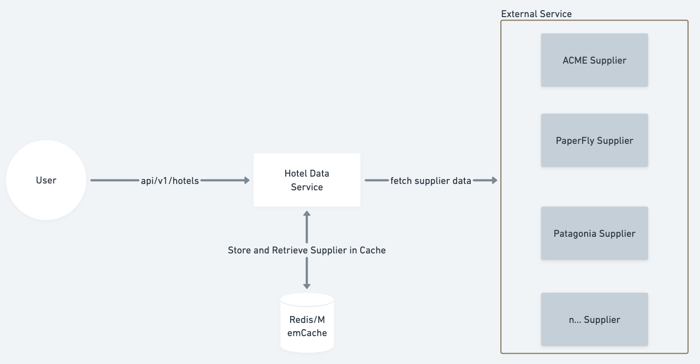
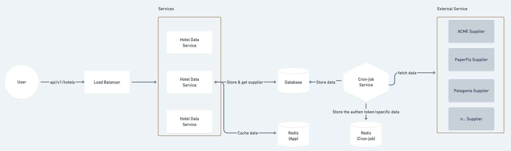

## Assumptions

For data cleaning and merging, we will apply the following rules:

- **Hotel Images:** We will merge all images that have the same hotel ID. This may result in duplicate content, but at least the URLs will be different.
- **Location:** Normalize country codes/names to the full country name.
- **Amenities:** Merge all amenities data for the same hotel ID and respond with an array of unique strings.
- **Name/Description:** Assume that the longest string is better than shorter strings. Therefore, we will merge data and select the longest string.

## High Level

We’ve opted for a straightforward design, as illustrated in the diagram below.

Pros: 
- The architecture is very simple.
- It’s easy to maintain.

Cons:
- High traffic to the hotel service will result in N x (Hotel service traffic) calls, which can be inefficient.
- Frequent calls to the supplier may increase costs.

## Proposed Solution

Our data source consists of a list of hotel data. To optimize performance, we can crawl this data and store it in our database on a scheduled basis (daily, hourly, etc.). This approach eliminates the need to fetch data when the client sends requests.

**Pros:**
- **Scalability:** The hotel service can scale to multiple instances based on traffic.
- **Decoupled process:** Separates the flow of searching and filtering hotels from the data crawling process from external suppliers.
- **Persistent data storage:** Data is stored in a database.
- **Redis caching:** Supports caching data, allowing the service to scale more effectively.
- **Separation of concerns:** The hotel service and cron-job are independent, allowing the cron-job to be scheduled to call external suppliers.

**Cons:**
- Requires maintenance of the database and cron-job.
- Increases deployment and maintenance costs.